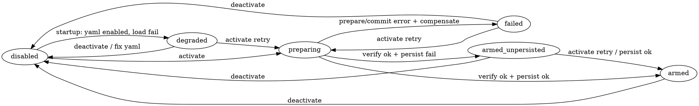

# Dashboard Paper Automation Activation Design

**Date:** 2026-07-20  
**Status:** approved; Phase 1 + Phase 2 implemented (hot-arm activate/deactivate + Scaling UI).  
**Depends on:** hybrid paper-auto / live-propose (`2026-07-20-hybrid-paper-auto-live-propose-design.md`), command-plane activation, P3 deterministic automation, command-center command gateway.  
**Related ops:** `scripts/bootstrap_paper_automation.py`, `docs/superpowers/rollout/trading-income-operations-runbook.md` (hybrid section).

## Problem

Paper automation (P3) is operable only via offline bootstrap + hand-edited `trader.yaml` / strategy YAML + service restart. Operators want an **Activate paper automation** control in the web command center that:

1. Generates the Ed25519 keypair on the **backend host filesystem** (never browser, never DuckDB).
2. Exports a fixture `PAPER_ELIGIBLE` artifact bundle.
3. Binds **exactly one** deployed strategy.
4. Arms the automation path without putting private key material on the wire.

Hot-arm without restart is desirable but is a mini distributed transaction (trader registry + strategy emitter + FS YAML). Shipping that as v1 raises maintainability and partial-state risk.

## Decision

**One design, two implementation phases:**

| Phase | Name | Behavior after successful Activate |
|-------|------|-------------------------------------|
| **1 (ship first)** | Restart-required | Persist config + materials; UI requires operator restart of trader + strategy; no in-process arm |
| **2 (follow-up)** | Hot-arm | Same prepare materials; then in-process commit/verify/persist with compensate-on-failure; no restart for steady-state arm |

Phase 2 must not ship until Phase 1 is green on paper (synthetic gates + at least one successful config-driven arm after restart). Phase 2 reuses Phase 1 RPCs/UI and adds state-machine transitions.

### Operator choices (locked)

- **Full arm intent** in one Activate click (prepare + enable), not a separate Enable button.
- **BE filesystem keygen** — private PEM `0o600` under `~/.config/mmr/keys/private/`; public PEMs in verify ring only. **No private keys in DuckDB.**
- **Strategy picker** — dropdown of currently deployed strategies.
- **Refuse** if `command_authority.enabled` is false (P1 before P3).
- **Paper only** — live account mode / `automation.live_enabled` hard-refuse.

## Non-goals

- Storing private keys in DuckDB, env, YAML values, RPC bodies, logs, or browser.
- Multi-strategy paper automation.
- `automation.live_enabled` / unattended live.
- Treating fixture attestations as P4 promotion evidence.
- Auto-restart without an explicit operator gesture (Phase 1 may offer a separate “Restart services” later; out of scope unless added explicitly).
- Generating keys in the browser.

---

## Status model (both phases)

### Lifecycle enum

```text
disabled          # automation.enabled false; no emitter; no execute_automated_intent (or refuse)
preparing         # Phase 2 only: keys/artifact in flight
restart_required  # Phase 1 success: YAML+materials ready; services not yet restarted
armed             # IntentEmitter + trader path active for the bound strategy
armed_unpersisted # In-memory armed but durable YAML enable failed or crash before persist (Phase 2)
failed            # Last Activate/Deactivate ended in error; automation off; last_error set
degraded          # Startup: YAML says enabled but registration/verify failed; stay disabled in memory
```

### Read model (snapshot / Scaling tab)

Expose under `paper_automation` (or equivalent):

| Field | Notes |
|-------|--------|
| `lifecycle` | Enum above |
| `phase` | Current phase name during long prepares (`prepare_keys`, `export_artifact`, …); null when idle |
| `strategy_name` | Bound name or null |
| `artifact_id` | Expected artifact id or null |
| `public_key_ring_path` | Path only (no key material) |
| `artifact_bundle_path` | Path only |
| `armed_unpersisted` | bool |
| `restart_required` | bool (Phase 1) |
| `last_activated_at` | ISO timestamp or null |
| `last_error` | Safe string; never PEM/private bytes |
| `command_authority_ready` | bool — prerequisite for Activate |
| `account_mode` | `paper` \| `live` |

Private key paths may appear in server logs at debug only if needed for ops; **never** in the read model or RPC response.

---

## Phase 1 — Restart-required (ship)

### UI

- **Scaling** tab, section **Paper automation** (below allocation controls).
- Status cards from read model.
- Controls when `commands_enabled` and paper:
  - Strategy `<select>` from deployed strategies.
  - Reason (required, max 200).
  - **Activate paper automation** — confirm dialog summarizing strategy + “services must restart”.
  - **Deactivate** — confirm; clears durable enable; `restart_required` until restart.
- When `lifecycle == restart_required`: prominent banner — “Config written. Restart trader and strategy services to arm.”
- When `lifecycle == armed_unpersisted` (Phase 2): banner — “Activation partially succeeded — click Activate again to complete.”

### RPC

Typed trader command (dashboard gateway), paper-only:

```text
activate_paper_automation(command_id, strategy_name, reason) -> ActivatePaperAutomationResult
deactivate_paper_automation(command_id, reason) -> DeactivatePaperAutomationResult
```

Optional Phase 1: require preflight ceremony for activate (same pattern as `activate_allocation`). Deactivate is risk-reducing: single confirm POST, no nonce.

#### `ActivatePaperAutomationResult` (public fields only)

```json
{
  "lifecycle": "restart_required",
  "strategy_name": "orb_googl",
  "artifact_id": "<hex>",
  "artifact_bundle_path": "~/.local/share/mmr/artifacts/<id>",
  "public_key_ring_path": "~/.config/mmr/keys/verify",
  "restart_required": true,
  "reused_existing_keys": false
}
```

### Activate algorithm (Phase 1)

1. **Gate:** paper mode; `command_authority.enabled`; not live automation; strategy exists in runtime YAML; strategy must not have `auto_execute: propose` (R1); refuse if another strategy is already bound when enabling.
2. **Keys (idempotent):** If `keys/private/signing.pem` + matching public PEM already exist and load cleanly, **reuse**. Else generate; write private `0o600`; write public into verify ring. Never put private bytes in DB/response.
3. **Artifact:** Export fixture `PAPER_ELIGIBLE` bundle signed with that key (same shape as `bootstrap_paper_automation.py`). On failure after creating a new orphan bundle dir, delete or mark orphan (best-effort cleanup).
4. **Persist (atomic):** Write user `trader.yaml` automation block via temp file + `os.replace` + `fsync` of directory where feasible. Log a redacted YAML diff (paths/ids/flags only). Set `enabled: true`, `live_enabled: false`, paths, `expected_artifact_id`, `strategy_name`. Patch strategy entry: `params.artifact_bundle_path`; strip `auto_execute: propose` if present.
5. **Do not** late-register trader service or build IntentEmitter in-process.
6. Return `restart_required`. Operator restarts trader + strategy; startup loads YAML and arms normally.

### Deactivate algorithm (Phase 1)

1. Tear down any in-memory automation pointers if present (no-op in Phase 1 cold path).
2. Best-effort persist `automation.enabled: false` (atomic write). If YAML write fails, still report success for in-memory teardown and set `last_error` + `armed_unpersisted`-style warning only if memory was armed (Phase 2).
3. Return `restart_required: true` so stale in-process state after a prior run cannot linger unnoticed — operator restarts to match YAML.

### Startup (both phases)

- **Strictly trust `trader.yaml` only** for desired enablement.
- If `automation.enabled: true` but key ring / artifact verify / stack registration fails → log loudly, set `last_error`, stay **disabled** in memory, expose `lifecycle: degraded`.
- Never invent enablement from a previous `armed_unpersisted` memory flag across process death.

---

## Phase 2 — Hot-arm (follow-up)

Reuses the same UI button and RPC names. Successful Activate ends in `armed` (or `armed_unpersisted` if persist fails after verify).

### State machine



### Internal phases (single RPC, audited by `command_id`)

| Phase | Actions | On failure |
|-------|---------|------------|
| `prepare_keys` | Idempotent keygen/reuse | Abort → `failed`; no enable |
| `export_artifact` | Fixture bundle export; cleanup orphan on fail | Compensate → `failed` |
| `trader_commit` | Build `AutomatedIntentCommandService`; late-register `execute_automated_intent` | Compensate trader → `failed` |
| `strategy_commit` | In-memory automation fields; verify artifact; build IntentEmitter; R1 exclusivity | Compensate strategy + trader → `failed` |
| `verify` | Both sides ready for same strategy + artifact id | Full compensate → `failed` |
| `persist` | Atomic YAML enable + strategy path | Leave memory armed → `armed_unpersisted`; UI retry banner |

**Emit gate:** IntentEmitter must refuse to send until trader capability shows `execute_automated_intent` registered for the bound artifact; trader must refuse intents that don’t match expected strategy/artifact binding. No orders during partial commit.

### Compensate

Always restore “automation off” in memory: clear emitter, unregister or hard-refuse automated intent handler, clear automation strategy binding flags. Prefer unregister if the typed registry supports it; otherwise wrap handler to refuse with a stable error code until process restart.

### Persist robustness

- Write to `trader.yaml.tmp` → `fsync` file → `os.replace` → best-effort `fsync` parent dir.
- Log exact redacted diff (keys: enabled, paths, artifact id, strategy name).
- Same for strategy YAML patch.

### Deactivate (Phase 2)

1. Always tear down in-memory state first (must succeed even if YAML fails).
2. Best-effort persist `enabled: false`.
3. Optional **force deactivate** (separate confirm): also delete private key + verify PEM + fixture bundle directories — default **off**; only if explicitly requested later.

### Chaos / tests (Phase 2 exit criteria)

Integration tests that interrupt at each phase boundary (simulate failure injection):

- Fail after keys, after artifact, after trader_commit, after strategy_commit, after verify, during persist (disk full / permission).
- Strategy unload during `strategy_commit`.
- Idempotent Activate when already `armed`.
- Retry from `armed_unpersisted` completes persist without re-keying.
- Startup with YAML enabled + missing artifact → `degraded`, no emitter.

Monitoring (ops, not necessarily code in v1): alert on `armed_unpersisted` or repeated Activate failures.

---

## Security

| Gate | Rule |
|------|------|
| Session + CSRF | Existing command-center `require_command_auth` |
| `DASHBOARD_COMMANDS_ENABLED` | Required |
| Account mode | Paper only for Activate |
| `command_authority.enabled` | Required; else refuse with clear code |
| Private key | Filesystem PKCS8 PEM `0o600` only; signing module hygiene unchanged |
| Response / journal | Public metadata only; audit phase transitions with `command_id` |
| Live | Hard refuse Activate / hot-arm |

---

## Relationship to CLI bootstrap

`scripts/bootstrap_paper_automation.py` remains valid for offline/air-gapped ops. Dashboard Activate is the guided equivalent for Phase 1+ (same paths layout). Do not commit keys or fixture bundles to git.

---

## Verification

| Gate | Phase |
|------|--------|
| Unit: refuse live / refuse without command authority / R1 propose conflict | 1 |
| Unit: idempotent key reuse; atomic YAML write | 1 |
| Integration: Activate → YAML on disk → restart → `execute_automated_intent` registered + emitter armed | 1 |
| Dashboard route + CSRF + commands_enabled | 1 |
| Chaos at each Phase 2 boundary + `armed_unpersisted` retry | 2 |
| Synthetic `p1` / `p3` gates still green | 1+2 |

## Success definition

- **Phase 1:** Operator can Activate from Scaling tab; after restart, one paper strategy runs unattended automation; Deactivate + restart turns it off; private keys never leave host FS.
- **Phase 2:** Same click arms without restart; partial failures compensate; `armed_unpersisted` is obvious and retryable; startup never silently runs half-armed automation from memory alone.

## Open follow-ups

- Explicit “Restart services now” dashboard button (pycron/compose) — optional UX after Phase 1.
- Force-deactivate that deletes keys/fixtures — optional, confirm-gated.
- Whether Activate uses live preflight ceremony in paper (recommend yes for consistency with allocation).
